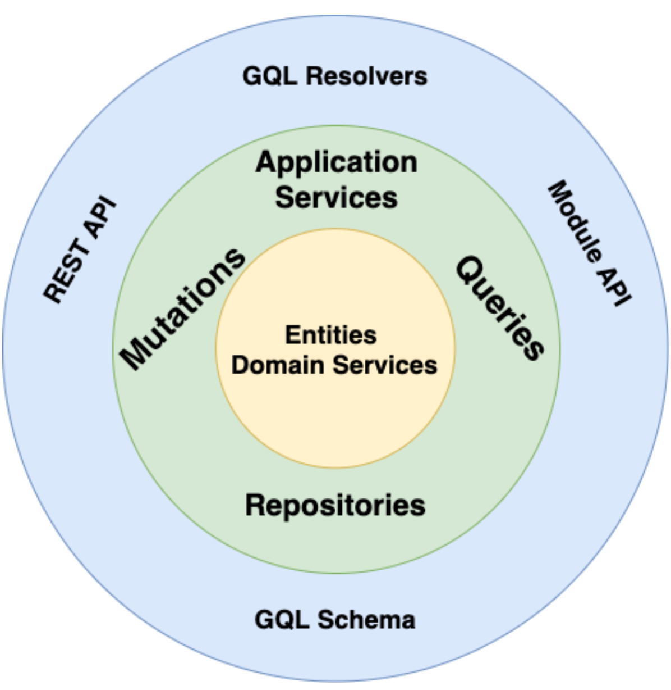

# An example of a GraphQL API with Apollo-Server and TypeScript by using principles like Domain-Driven Design and Clean Architecture.

Since that's an example, we should have a specific business case to build our software around it.

Let's consider we're a Cloud Service Provider like Digital Ocean, AWS, etc. We provide developers cloud infrastructure-as-a-service platforms. For instance, if someone wants a cloud server to host their application, he comes to us.

We allow only SMBs to register on our website. Each company can have multiple employees.

The main business scenario we have in our example is managing billing related stuff like adding card payment methods, updating billing addresses, invoicing, etc. That's the most crucial area of our business.

Our goal is to design and create a highly scalable and maintainable API with GraphQL around the above-mentioned business domain.

> 💡 We're modeling software to solve complex real life business problems.

## Domains

- Account:

  - Account & User entities (subdomains)

- Billing:
  - Card Payment Profile entity (subdomain)

## Used Technologies and Tools:

- [GraphQL](https://graphql.org/)
- [Apollo-Server](https://www.apollographql.com/docs/apollo-server/)
- [TypeScript](https://www.typescriptlang.org/)
- [GraphQL Tools](https://the-guild.dev/graphql/tools)
  - [Schema Merging](https://the-guild.dev/graphql/tools/docs/schema-merging)
  - [Code Generation](https://the-guild.dev/graphql/codegen) - TypeScript types based on our GraphQL Schema

## Architectural Principles:

- Domain-Driven Design

  - => Better Subdomain Organization

  Code that acts as a software representation of the business is more correct, more tolerant to change, has less inaccurate and undesirable side-effects, and can be understood by everyone.

  - Ubiquitous Language

  - Bounded Contexts

- Clean-Architecture (aka Layered Architecture)

  - => better separation of concerns, testability, maintainability

> 💡 In the real world, developing a project from scratch by embracing all "super duper" practices, concepts and technologies is an overkill, in my opinion. Better, strive for incremental improvements by tailoring the "techy" methods and making them suits your needs and experience.

## Notes

Since the Account Domain is simpler, there's no need to introduce DDD and/or Clean Architecture. We can follow the Transaction Script Pattern.

However, the Billing Domain is crucial for our business and will evolve a lot in the future, so here we will embrace DDD and Clean Architecture.

There's no need to implement DDD and Clean Architecture on 100%. Make it suits your case, experience and needs.

In this way, we can see:

- the difference between the two domains
- the cost of having and not having the mentioned patterns

In the end, it's all about trade-offs.

### Regarding the Code - illustrations & examples

Most of the concepts explained here are illustrated under the `Billing` Domain.

In our example, I haven't abstracted the "Aggregate / Aggregate Root" concepts since I want to keep the example as simple as possible for now.

The code example in progress 🚧. I will be extending it step by step in the future.

🔔 Subscribe to get notified or follow me on [LinkedIn](https://www.linkedin.com/in/petarivanovv9) for the newest updates.

#### What's upcoming in the code example:

- [ ] Add Dependency Injection - use `tsyringe`
- [ ] Add `jest` and implement the missing tests
- [ ] Extend the case study and domains with more examples and illustrations
- [ ] Add more abstraction - Aggregate / Aggregate Root / Use Cases, etc.

# High-Level Architecture Overview

The core principle of Clean Architecture is that dependencies can only point inwards.

# Folder Structure => src/modules

Let's focus on the `/src/modules` folder since that's the most important folder in our example.

Modules <> Domains.

## Sub-Domains (ex: Account, Billing)

Each subdomain (or domain in short):

- Contain the GQL schema and resolvers for that subdomain.
  - Use schema merging to merge each subdomain GQL module.
- Contain the implementation of that particular subdomain.
- Expose a Module service (ex: AccountModule, BillingModule) that define the interface that other modules would use it to communicate with it.
  - doesn't expose implementation details;
  - uses TypeScript interfaces or DTOs for defining the return values and parameters;

=> decoupled modules.

### API

Define the interface that other modules would use it to communicate with it.

### Domain

#### Models (aka Entities & Domain Services)

Entities are at the core of a Domain Model. Entities are plan JavaScript objects that do not have dependencies on anything else. Entities represent a concept in the domain that is identified by its id.

Value Objects are part of the same layer. They represent concepts that do not have a conceptual identity. Value Objects are immutable. Eg: billing address.

Domain Services encapsulate domain logic and concepts that are not naturally modelled as Value Objects or Entities in our model. Domain Services do not have identity or state. Their responsibility is to orchestrate business logic using entities and value objects.

#### Mutations

Mutations map to GraphQL mutations. They can be implemented as separate classes or an Application Service grouping multiple mutations.

#### Queries

Queries map to GraphQL queries. They can be implemented as separate classes or an Application Service grouping multiple queries.

#### Services

Application Services, like Mutation and Queries, operate on a higher level of abstraction. They use the Repositories to load and persist Aggregates, they use Domain Services and other external (or Module) services to fulfil their business use cases.

### GraphQL - schema definition and resolvers.

GraphQL Resolvers would take care of mapping GraphQL types to the Domain Entities. Generally, our entities should match the
structure of our GQL types so the Resolvers should be relatively simple and most of the time not require additional mapping layer.

### Repositories

Repositories, with the help of mappers, load Aggregates and persist changes to them. In the Domain Model Pattern, the DB access is abstracted as an infrastructure (that’s why you can find the DB access in the outermost layer).

Additionally, Repositories can be used for queries that load Entities.

# Other Terms

- Aggregates

> An "aggregate" is a cluster of associated objects that we treat as a unit for the purpose of data changes." - Evans. 126

Aggregates are a collection of entities and value objects that are bound together by an aggregate root. The aggregate root is the thing that we refer to for lookups. No members from within the aggregate boundary can be referred to directly from anything external to the aggregate. Aggregates ensure consistency and define transactional concurrency boundaries.

- Aggregate Root

Aggregate Root represents a cluster of associated objects treated as a single unit. It is responsible for enforcing consistency and maintaining the integrity of the aggregate's internal state. The aggregate root is the entry point for accessing and modifying the objects within the aggregate.
